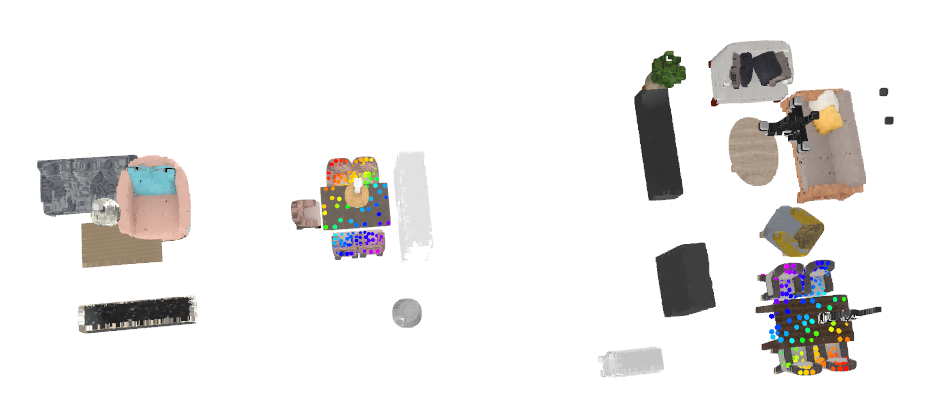

# 3D Scene Analogies
Official PyTorch implementation of **Learning 3D Scene Analogies with Neural Contextual Scene Maps (ICCV 2025)** [[Paper]](https://openaccess.thecvf.com/content/ICCV2025/html/Kim_Learning_3D_Scene_Analogies_with_Neural_Contextual_Scene_Maps_ICCV_2025_paper.html) [[Video]](https://www.youtube.com/watch?v=WTwbSAqTpE8).

[](overview.png)

From a pair of 3D scenes, **3D scene anologies** are defined as dense maps that connect regions sharing similar spatial context.

In this repository, we provide the implementation and instructions for running our calibration method. If you have any questions regarding the implementation, please leave an issue or contact 82magnolia@snu.ac.kr.

## Installation
First install pytorch and pytorch3d using the following command:
```
conda create -n nrfield python=3.9
conda activate nrfield
conda install pytorch=1.13.0 torchvision pytorch-cuda=11.6 -c pytorch -c nvidia
# For ubuntu 22.04, try the following instead
conda install pytorch=1.13.0 torchvision pytorch-cuda=11.6 numpy<1.9 -c pytorch -c nvidia
conda install -c fvcore -c iopath -c conda-forge fvcore iopath
conda install pytorch3d -c pytorch3d
```

Then, install the remaining dependencies with the following command:
```
pip install -r requirements.txt
```

## Dataset Preparation (3D-FRONT & ARKitScenes)

First, run the following command to make a `data/` folder.
```
cd $PATH_TO_REPO
mkdir data/
```

### 3D-FRONT
For 3D-FRONT, download all files from the following [link](https://tianchi.aliyun.com/dataset/65347), unzip, and organize the files in the following structure under the `data/` folder.

    3d_scene_analogies/data
    └── 3D-FRONT
    └── 3D-FRONT-texture
    └── 3D-FRONT-model

Then, run the following command to sample points from 3D meshes in the dataset to accelerate training/evaluation.
```
python -m threed_front.extract_point_samples --save_num_samples 50 100 200 400
```

#### Training Scene Generation
Run the following script to generate scene triplets for neural field training.
Please refer to [Section 3 in the main paper](https://arxiv.org/html/2503.15897v2#S3) for more details.
```
python -m threed_front.main_scene_gen --num_load_layout -1 --save_root ./data/3d_front_scenes/3d_front_large_noise --max_trans_noise 0.5 --max_rot_noise 90 --num_scenes 15000
```

Alternatively, one can download a pre-generated set of scenes from this [link](https://drive.google.com/drive/folders/1Y0OtIHjo7lCpUU8LRmdG5_aU7f3FyVrh?usp=sharing).
Once downloaded, unzip and place the folder under `./data/3d_front_scenes/3d_front_large_noise`.

#### Evaluation Scene Generation
Run the following script to generate synthetic scene pairs for evaluating 3D scene analogies.
Please refer to [Section 4 in the main paper](https://arxiv.org/html/2503.15897v2#S4) for more details.
```
python -m threed_front.main_scene_augment --orig_scene_root ./data/3d_front_scenes/3d_front_large_noise
```

Alternatively, one can download a pre-generated set of scenes from this [link](https://drive.google.com/drive/folders/1Y0OtIHjo7lCpUU8LRmdG5_aU7f3FyVrh?usp=sharing).
Once downloaded, unzip and place the folder under `./data/3d_front_scenes/3d_front_large_noise_augment`.

### ARKitScenes
For ARKitScenes, first clone the following [repository](https://github.com/apple/ARKitScenes).
Then, run the following command within the repository to download the `train/test` 3D meshes created from RGB-D fusion (further instructions available [here](https://github.com/apple/ARKitScenes/blob/main/DATA.md)).
```
python3 download_data.py raw --video_id_csv raw/raw_train_val_splits.csv --download_dir ~/Downloads/tmp/ \
--raw_dataset_assets mesh annotation
```
Then, rename `Training` to `train` and `Validation` to `test`, and organize the files in the following structure under the `data/` folder.

    3d_scene_analogies/data
    └── arkit_scenes
        ├── train
        └── test

Further, run the following command to sample points from 3D meshes in the dataset to accelerate training/evaluation.
```
python -m arkit.extract_point_samples --save_num_samples 50 100 200
```

Finally, run the following command to obtain object meshes from bounding box annotations in ARKitScenes.
```
python -m arkit.main_asset_gen
```

#### Training Scene Generation
Run the following script to generate scene triplets for neural field training.
Please refer to [Section 3 in the main paper](https://arxiv.org/html/2503.15897v2#S3) for more details.
```
python -m arkit.main_scene_gen --save_root ./data/arkit_large_noise/ --max_trans_noise 0.5 --max_rot_noise 90
```

Alternatively, one can download a pre-generated set of scenes from this [link](https://drive.google.com/drive/folders/1Y0OtIHjo7lCpUU8LRmdG5_aU7f3FyVrh?usp=sharing).
Once downloaded, unzip and place the folder under `./data/arkit_large_noise`.

#### Evaluation Scene Generation
Run the following script to generate synthetic scene pairs for evaluating 3D scene analogies.
Please refer to [Section 4 in the main paper](https://arxiv.org/html/2503.15897v2#S4) for more details.
```
python -m arkit.main_scene_augment --orig_scene_root ./data/arkit_large_noise/
```

Alternatively, one can download a pre-generated set of scenes from this [link](https://drive.google.com/drive/folders/1Y0OtIHjo7lCpUU8LRmdG5_aU7f3FyVrh?usp=sharing).
Once downloaded, unzip and place the folder under `./data/arkit_large_noise_augment`.

## Pretrained Models
Please download the models from the following [link](https://drive.google.com/drive/folders/10LxXpkZXC0_roXWQ3BA3g_kvKJzRsKym?usp=sharing).
Then place the models under the `pretrained/` folder.

## Quickstart on Your Own Data!
To start, prepare a colored point cloud in `.ply` format and an instance label point cloud also in `.ply` format, similar to the samples stored in `sample_demo_pcd/`.

Specifically, the colored point cloud should be saved in `[x y z r g b]` format and the instance point cloud should be similarly saved in `[x y z instance_id instance_id instance_id]` format.

**Note:** Our model assumes the +y direction to point upwards (i.e., opposite to the gravity direction). Please align your data accordingly.

### Step 1. Obtaining Instance Label Point Clouds
We provide convenience scripts to extract instance label point clouds.
If these scripts don't work for your data, try obtaining instance labels from off-the-shelf segmentation algorithms such as [Mask3D](https://github.com/JonasSchult/Mask3D).

#### Mesh Scenes
If the original 3D scene is organized in the following structure, with each `obj_i/` containing mesh files in `.ply` format for a scene object, `extract_pcd_from_mesh.py` can extract colored point clouds and instance label point clouds from the meshes.

    scene_mesh_root/
    └── obj_1
        └── model.ply
    └── obj_2
        └── model.ply
    ...
    └── obj_N
        └── model.ply

Run the following command to process the meshes.
```
python -m demo_zero_shot.extract_pcd_from_mesh --scene_dir $PATH_TO_MESH --save_pcd_path $PATH_TO_MESH/scene_pcd.ply
```

#### Point Cloud Scenes
If the original 3D scene is a point cloud with an equal number of points per each object, run the following command to obtain an instance label point cloud.
```
python -m demo_zero_shot.extract_inst_pcd --pcd_path $PATH_TO_POINT_CLOUD
```

### Step 2. Finding 3D Scene Analogies
We provide an additional pre-trained model for zero-shot evaluation: *semantics-agnostic* model (`3dfront_no_semantic`) which does not take semantic labels as input.
Download the model from this [link](https://drive.google.com/drive/folders/10LxXpkZXC0_roXWQ3BA3g_kvKJzRsKym?usp=sharing).

Run the following command to obtain 3D scene analogies using the semantics-agnostic model.
Please specify the region of interest (RoI) to match using the `--roi_ids` field.
```
python -m demo_zero_shot.main_pcd_analogy --log_dir ./log/demo_test_pair/ --load_local_feature_field ./pretrained/3dfront_no_semantic/model.pth --load_global_feature_field ./pretrained/3dfront_no_semantic/model.pth --num_vert_split 1 --local_rbf_smoothing 0.5 --global_num_rot 4 --global_dist_valid_thres 1.5 --global_mapping_type scale_rot --global_topk 30 --pcd_tgt ./sample_demo_pcd/target_scene/scene_pcd.ply --pcd_ref ./sample_demo_pcd/reference_scene/scene_pcd.ply --roi_ids 3 4 5 6 7 --field_type distance --vis_local_match_mode intra_match --local_topk 1 --scene_sample_points 100 --num_query 100
```

This will yield a visualization as shown below.
Note the floor contours are omitted as the model only takes object points as input.

[](example_demo_pcd.png)


## Quickstart (3D-FRONT & ARKitScenes)
### 3D-FRONT
Run the following script to generate visualizations for a few examples in the 3D-FRONT dataset.
```
python -m threed_front.main_field_match --scene_root ./data/3d_front_scenes/3d_front_large_noise --log_dir ./log/tdf_demo/ --load_local_feature_field ./pretrained/3dfront_default/model.pth --load_global_feature_field ./pretrained/3dfront_default/model.pth --scene_buffer_size -1 --num_vert_split 1 --local_rbf_smoothing 0.5 --eval_reps 1 --batch_size 1 --global_num_rot 4 --global_dist_valid_thres 1.5 --global_mapping_type scale_rot --global_topk 30 --seed 10 --scene_pair_type manual --scene_pair_file ./sample_scene_pairs/td_front_sample.tsv --vis_local_match_mode intra_match --vis_method screen
```
This will yield a visualization as shown below.
[](example_3d_front.png)

### ARKitScenes
Run the following script to generate visualizations for a few examples in the ARKitScenes dataset.
```
python -m arkit.main_field_match --scene_root ./data/arkit_large_noise --log_dir ./log/arkit_demo --load_local_feature_field ./pretrained/arkit_default/model.pth --load_global_feature_field ./pretrained/arkit_default/model.pth --scene_buffer_size -1 --num_vert_split 1 --local_rbf_smoothing 0.5 --eval_reps 1 --batch_size 1 --global_num_rot 4 --global_dist_valid_thres 1.5 --global_mapping_type scale_rot --global_topk 30 --seed 10 --scene_pair_type manual --local_valid_thres 1.5 --scene_pair_file ./sample_scene_pairs/arkit_sample.tsv --vis_local_match_mode intra_match --vis_method screen
```
This will yield a visualization as shown below.
[](example_arkit.png)

## Evaluation (3D-FRONT & ARKitScenes)
### 3D-FRONT
To run evaluation on **procedurally generated scenes**, run the following command.
```
python -m threed_front.main_field_match --scene_root ./data/3d_front_scenes/3d_front_large_noise --log_dir ./log/tdf_proc_eval_demo/ --load_local_feature_field ./pretrained/3dfront_default/model.pth --load_global_feature_field ./pretrained/3dfront_default/model.pth --scene_buffer_size -1 --num_vert_split 1 --local_rbf_smoothing 0.5 --eval_reps 1 --batch_size 1 --global_num_rot 4 --global_dist_valid_thres 1.5 --global_mapping_type scale_rot --global_topk 30 --seed 10 --scene_pair_type augment --query_point_type obj_match_points
```

To run evaluation on **manually collected scenes**, run the following command.
```
python -m threed_front.main_field_match --scene_root ./data/3d_front_scenes/3d_front_large_noise --log_dir ./log/tdf_eval_demo/ --load_local_feature_field ./pretrained/3dfront_default/model.pth --load_global_feature_field ./pretrained/3dfront_default/model.pth --scene_buffer_size -1 --num_vert_split 1 --local_rbf_smoothing 0.5 --eval_reps 1 --batch_size 1 --global_num_rot 4 --global_dist_valid_thres 1.5 --global_mapping_type scale_rot --global_topk 30 --seed 10 --scene_pair_type manual --scene_pair_file ./sample_scene_pairs/td_front_eval_sample.tsv
```

### ARKitScenes
To run evaluation on **procedurally generated scenes**, run the following command.
One can visualize the training curve using [Wandb](https://wandb.ai/).
```
python -m arkit.main_field_match --scene_root ./data/arkit_large_noise --log_dir ./log/arkit_proc_eval_demo/ --load_local_feature_field ./pretrained/arkit_default/model.pth --load_global_feature_field ./pretrained/arkit_default/model.pth --scene_buffer_size -1 --num_vert_split 1 --local_rbf_smoothing 0.5 --eval_reps 1 --batch_size 1 --global_num_rot 4 --global_dist_valid_thres 1.5 --global_mapping_type scale_rot --global_topk 30 --seed 10 --scene_pair_type augment --query_point_type obj_match_points --local_valid_thres 1.5
```

To run evaluation on **manually collected scenes**, run the following command.
One can visualize the training curve using [Wandb](https://wandb.ai/).
```
python -m arkit.main_field_match --scene_root ./data/arkit_large_noise --log_dir ./log/arkit_eval_demo --load_local_feature_field ./pretrained/arkit_default/model.pth --load_global_feature_field ./pretrained/arkit_default/model.pth --scene_buffer_size -1 --num_vert_split 1 --local_rbf_smoothing 0.5 --eval_reps 1 --batch_size 1 --global_num_rot 4 --global_dist_valid_thres 1.5 --global_mapping_type scale_rot --global_topk 30 --seed 10 --scene_pair_type manual --local_valid_thres 1.5 --scene_pair_file ./sample_scene_pairs/arkit_eval_sample.tsv
```

## Training (3D-FRONT & ARKitScenes)
### 3D-FRONT
To train a context descriptor field on 3D-FRONT, run the following command.
```
python -m threed_front.trainer --scene_root ./data/3d_front_scenes/3d_front_large_noise --normalize_feats --wandb --log_dir ./log/3d_front_train_demo --run_name 3d_front_train_demo --agg_radius 0.75 --num_cache_query 400 --query_point_type obj_match_points --query_obj_match_add_bbox
```

### ARKitScenes
To train a context descriptor field on ARKitScenes, run the following command.
```
python -m arkit.trainer --scene_root ./data/arkit_large_noise --normalize_feats --wandb --log_dir ./log/arkit_train_demo --run_name arkit_train_demo --agg_radius 0.75 --num_cache_query 200 --query_point_type obj_match_points --query_obj_match_add_bbox
```

## Citation
If you find this repository useful, please cite

```bibtex
@InProceedings{Kim_2025_ICCV,
    author    = {Kim, Junho and Bae, Gwangtak and Lee, Eun Sun and Kim, Young Min},
    title     = {Learning 3D Scene Analogies with Neural Contextual Scene Maps},
    booktitle = {Proceedings of the IEEE/CVF International Conference on Computer Vision (ICCV)},
    month     = {October},
    year      = {2025},
    pages     = {7828-7840}
}
```